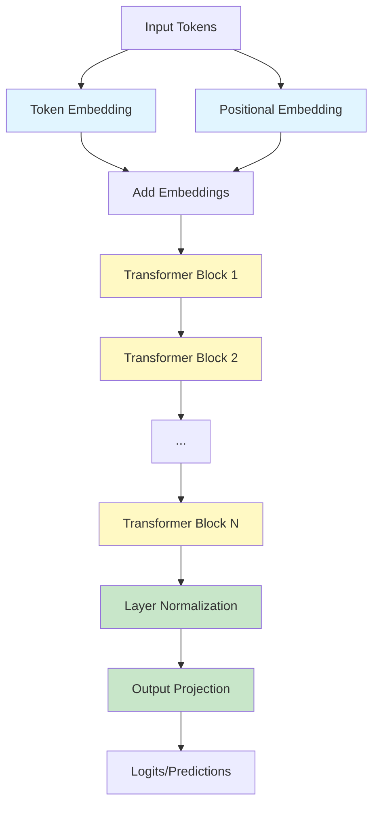
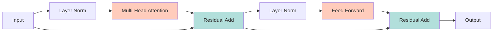

# GPT from Scratch using NumPy

A complete educational implementation of GPT (Generative Pre-trained Transformer) using **only NumPy**. This project breaks down every component of the transformer architecture with detailed mathematical explanations and clean, readable code.


## 🎯 Purpose

This project is designed for **learning and understanding** transformer architectures from first principles. Every component is implemented from scratch with:
- ✅ Detailed mathematical explanations
- ✅ Clear, readable code with extensive comments
- ✅ No deep learning frameworks (PyTorch, TensorFlow, etc.)
- ✅ Complete backpropagation implementation

## 🏗️ Architecture Overview

GPT is an autoregressive transformer-based language model. Here's what it contains:



### Transformer Block Architecture

Each transformer block contains:



## 📚 Key Concepts Explained

### 1. **Self-Attention Mechanism**

The core innovation of transformers. Allows the model to weigh the importance of different words when processing each word.

**Mathematical Formula:**
```
Attention(Q, K, V) = softmax(QK^T / √d_k) V
```

Where:
- **Q** (Query): "What am I looking for?"
- **K** (Key): "What do I contain?"
- **V** (Value): "What information do I have?"
- **d_k**: Dimension of key vectors (for scaling)

**Intuition**: When processing the word "it" in "The cat sat on the mat because it was tired", attention helps the model understand that "it" refers to "cat".

### 2. **Multi-Head Attention**

Instead of single attention, we use multiple attention "heads" in parallel, each learning different relationships.

**Formula:**
```
MultiHead(Q,K,V) = Concat(head₁, ..., headₕ)W^O
where head_i = Attention(QW^Q_i, KW^K_i, VW^V_i)
```

**Why?** Different heads can capture different types of relationships:
- Head 1: Syntactic relationships (subject-verb)
- Head 2: Semantic relationships (synonyms)
- Head 3: Long-range dependencies
- etc.

### 3. **Positional Embeddings**

Since attention has no inherent concept of order, we add positional information to embeddings.

**Method**: Each position gets a unique learnable embedding vector that's added to the token embedding.

### 4. **Layer Normalization**

Normalizes activations to have mean=0 and variance=1, which stabilizes training.

**Formula:**
```
LayerNorm(x) = γ * (x - μ) / √(σ² + ε) + β
```

### 5. **Residual Connections**

Add the input of a sub-layer to its output: `output = SubLayer(x) + x`

**Why?** Helps gradients flow in deep networks, preventing vanishing gradient problem.

### 6. **Feed-Forward Networks**

Position-wise fully connected layers that process each position independently.

**Formula:**
```
FFN(x) = GELU(xW₁ + b₁)W₂ + b₂
```

Typically expands to 4x the model dimension, then projects back.

## 📁 Project Structure

```
gpt-numpy/
├── gpt_numpy.py          # Core GPT implementation
│   ├── Embedding         # Token and positional embeddings
│   ├── LayerNorm         # Layer normalization
│   ├── GELU              # Activation function
│   ├── Linear            # Fully connected layer
│   ├── MultiHeadAttention# Attention mechanism
│   ├── FeedForward       # Position-wise FFN
│   ├── TransformerBlock  # Complete transformer layer
│   └── GPT               # Full model
│
├── train.py              # Training infrastructure
│   ├── AdamOptimizer     # Adam optimization algorithm
│   ├── TextDataset       # Character-level data loader
│   ├── cross_entropy_loss# Loss computation
│   └── train()           # Training loop
│
├── example.py            # Quick demonstration
├── data/
│   └── shakespeare.txt   # Sample training data
└── README.md             # This file
```

## 🚀 Quick Start

### Installation

```bash
# Only numpy is required!
pip install numpy

# Optional: for visualization
pip install matplotlib
```

### Quick Example

Run the example script to see the model in action:

```bash
python example.py
```

This will:
1. Create a small GPT model
2. Train it for 50 epochs (quick demo)
3. Show generations before and after training
4. Save and load the model

### Full Training

For better results, run the full training script:

```bash
python train.py
```

**Default settings:**
- Model size: 128-dimensional embeddings
- Layers: 4 transformer blocks
- Attention heads: 4
- Training epochs: 500
- Batch size: 32

**Expected results:**
- Training should take 10-30 minutes on CPU (depending on your machine)
- Loss should decrease from ~4.0 to ~1.5-2.0
- Generated text will mimic Shakespeare's style

### Custom Training Data

Replace `data/shakespeare.txt` with your own text file:

```python
# In train.py, change the data path:
data_path = "data/your_custom_text.txt"
```

## 🧮 Mathematical Details

### Forward Pass

For an input sequence of token indices `x`:

1. **Embedding**: 
   ```
   E_token = EmbeddingMatrix[x]
   E_pos = PositionalEmbedding[0, 1, 2, ..., seq_len-1]
   E = E_token + E_pos
   ```

2. **Transformer Blocks** (repeated N times):
   ```
   # Attention sub-layer
   norm1 = LayerNorm(E)
   attn_out = MultiHeadAttention(norm1)
   E = E + attn_out  # Residual
   
   # Feed-forward sub-layer
   norm2 = LayerNorm(E)
   ff_out = FeedForward(norm2)
   E = E + ff_out  # Residual
   ```

3. **Output**:
   ```
   final = LayerNorm(E)
   logits = Linear(final)  # Project to vocabulary size
   ```

### Backward Pass (Backpropagation)

The gradient flows backward through:
1. Output projection
2. Final layer norm
3. Each transformer block (in reverse)
4. Embeddings

Each component computes:
- Gradient w.r.t. its input
- Gradients w.r.t. its learnable parameters

### Adam Optimizer

Updates parameters using adaptive learning rates:

```
m_t = β₁ * m_{t-1} + (1 - β₁) * g_t          # First moment
v_t = β₂ * v_{t-1} + (1 - β₂) * g_t²         # Second moment

m̂_t = m_t / (1 - β₁^t)                       # Bias correction
v̂_t = v_t / (1 - β₂^t)

θ_t = θ_{t-1} - α * m̂_t / (√v̂_t + ε)        # Update
```

**Parameters:**
- `α`: Learning rate (typically 1e-4 to 1e-3)
- `β₁`: First moment decay (typically 0.9)
- `β₂`: Second moment decay (typically 0.999)
- `ε`: Numerical stability constant (1e-8)

## 🎓 Educational Highlights

### What You'll Learn

1. **Transformer Architecture**
   - How attention works mathematically
   - Why multi-head attention is powerful
   - Role of layer normalization and residual connections

2. **Training Deep Networks**
   - Backpropagation through complex architectures
   - Gradient computation for matrix operations
   - Optimization with Adam

3. **Language Modeling**
   - Autoregressive generation
   - Next-token prediction
   - Character-level vs. token-level modeling

4. **Implementation Skills**
   - Efficient NumPy operations
   - Managing gradients in custom layers
   - Numerical stability considerations

### Key Files to Study

| File | Focus Area | Key Concepts |
|------|-----------|--------------|
| `gpt_numpy.py` → **MultiHeadAttention** | Attention mechanism | Scaled dot-product attention, queries/keys/values |
| `gpt_numpy.py` → **TransformerBlock** | Architecture design | Residual connections, layer norm placement |
| `train.py` → **AdamOptimizer** | Optimization | Adaptive learning rates, momentum |
| `train.py` → **cross_entropy_loss** | Training objectives | Likelihood maximization, softmax |

## 🔧 Customization

### Adjust Model Size

In `train.py` or `example.py`:

```python
model = GPT(
    vocab_size=dataset.vocab_size,
    d_model=256,        # Increase for larger model
    num_layers=6,       # More layers = deeper network
    num_heads=8,        # More heads = more parallel attention
    d_ff=1024,          # Larger FFN = more capacity
    max_seq_len=128,    # Longer context window
    dropout=0.1         # Regularization
)
```

### Adjust Training

```python
train(
    model=model,
    dataset=dataset,
    num_epochs=1000,           # More epochs = better convergence
    batch_size=64,             # Larger batch = more stable gradients
    learning_rate=1e-4,        # Lower LR = slower but more stable
    eval_interval=50,          # How often to evaluate
    eval_samples=10            # More samples = better val estimate
)
```

## 📊 Performance Notes

### Model Size vs. Quality

| Config | Parameters | Training Time | Quality |
|--------|-----------|---------------|---------|
| Tiny (d=64, L=2) | ~50K | 5 min | Basic patterns |
| Small (d=128, L=4) | ~200K | 20 min | Decent coherence |
| Medium (d=256, L=6) | ~1M | 1-2 hours | Good quality |
| Large (d=512, L=12) | ~10M | 8+ hours | High quality |

*Times are approximate for CPU training on Shakespeare dataset*

### Optimization Tips

1. **GPU Acceleration**: While this uses only NumPy, you could adapt it to use CuPy for GPU support
2. **Gradient Clipping**: Add to prevent exploding gradients
3. **Learning Rate Scheduling**: Decay learning rate over time
4. **Larger Dataset**: More data = better generalization

## 🐛 Common Issues

### Issue: Loss is NaN

**Causes:**
- Learning rate too high
- Numerical instability in softmax

**Solutions:**
```python
# Reduce learning rate
optimizer = AdamOptimizer(learning_rate=1e-4)

# Already handled in code via log-sum-exp trick
```

### Issue: Generation is repetitive

**Causes:**
- Model not trained enough
- Temperature too low

**Solutions:**
```python
# Train longer
num_epochs = 1000

# Increase temperature for more randomness
model.generate(tokens, temperature=1.0)  # Try 0.8 to 1.2
```

### Issue: Training is slow

**Solutions:**
- Reduce model size
- Reduce batch size
- Use shorter sequences
- Consider GPU implementation

## 📖 References

### Papers

1. **"Attention Is All You Need"** (Vaswani et al., 2017)
   - Original transformer paper
   - https://arxiv.org/abs/1706.03762

2. **"Language Models are Unsupervised Multitask Learners"** (Radford et al., 2019)
   - GPT-2 paper
   - https://d4mucfpksywv.cloudfront.net/better-language-models/language_models_are_unsupervised_multitask_learners.pdf

3. **"Adam: A Method for Stochastic Optimization"** (Kingma & Ba, 2014)
   - Adam optimizer
   - https://arxiv.org/abs/1412.6980

### Resources

- [The Illustrated Transformer](http://jalammar.github.io/illustrated-transformer/)
- [The Annotated Transformer](http://nlp.seas.harvard.edu/annotated-transformer/)
- [Andrej Karpathy's minGPT](https://github.com/karpathy/minGPT)

## 🤝 Contributing

This is an educational project. Feel free to:
- Add more documentation
- Improve code comments
- Add visualization tools
- Optimize performance
- Fix bugs

## 📄 License

MIT License - Feel free to use for learning and teaching!

## 🙏 Acknowledgments

Inspired by:
- Andrej Karpathy's educational content
- The original transformer and GPT papers
- The NumPy community

---

## 🎯 Next Steps

After mastering this implementation:

1. **Implement variants**:
   - BERT (bidirectional transformer)
   - GPT-2/3 (larger models)
   - Vision Transformer (ViT)

2. **Add features**:
   - Beam search for generation
   - Top-k / nucleus sampling
   - Attention visualization
   - Gradient checkpointing

3. **Scale up**:
   - Convert to PyTorch/JAX
   - Implement data parallelism
   - Use larger datasets (e.g., WikiText)
   - Fine-tune on specific tasks

4. **Explore applications**:
   - Text generation
   - Machine translation
   - Question answering
   - Code generation

---

**Happy Learning! 🚀**

*Remember: The best way to understand transformers is to implement them yourself.*
